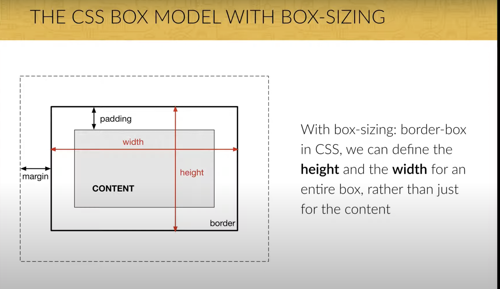

### The CSS Box Model with Box-Sizing



- **Box Model Components**:

  - **Content**: The innermost part of the box where text and images appear.
  - **Padding**: Clears an area around the content inside the box.
  - **Border**: Surrounds the padding and content.
  - **Margin**: Clears an area outside the border.

- **Width and Height with Box-Sizing**:
  - **Default Box-Sizing (content-box)**:
    - `width` and `height` properties apply only to the content area.
    - Total width = content width + padding + border.
    - Total height = content height + padding + border.
  - **Box-Sizing: Border-Box**:
    - `width` and `height` properties include padding and border.
    - Total width and height remain as specified, not increasing with padding and border.
    - Useful for consistent box dimensions and simpler layout management.

### Example Code

```css
/* Default box-sizing (content-box) */
.element {
  width: 300px;
  padding: 20px;
  border: 10px solid black;
}

/* Box-sizing: border-box */
.element-border-box {
  box-sizing: border-box;
  width: 300px;
  padding: 20px;
  border: 10px solid black;
}
```

#### Explanation

- **Default Box-Sizing (content-box)**:
  - Total width = 300px (content) + 20px (padding) + 10px (border) = 340px.
  - Total height = height of content + padding + border.
- **Box-Sizing: Border-Box**:
  - Total width remains 300px including padding and border.
  - Total height remains the specified height including padding and border.

for more information:-

https://www.youtube.com/watch?v=NZmtVtPdIqQ&list=PLvtRgUbhWmy9VgVvvxfiXXriELtjaYYmw&index=8
