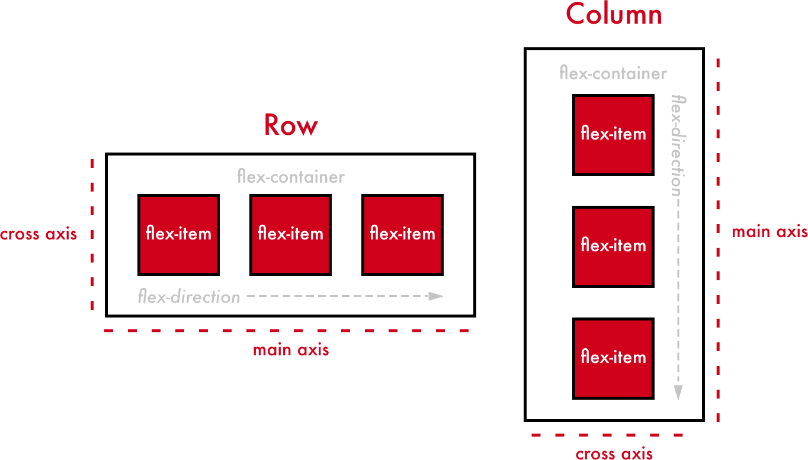
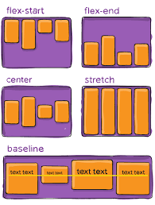

## Flexbox Overview



### Introduction to Flexbox

Flexbox (Flexible Box Layout) is a one-dimensional layout model that allows you to design layouts in a more efficient way, distributing space and aligning items within a container.

### Key Properties of Flexbox

- `display: flex;`: Defines a flex container and enables flex context for all its direct children.(Define in parent element )
- `flex-direction`: Establishes the main axis and defines the direction in which flex items are placed in the flex container.
  - `row` (default): Items are placed horizontally.
  - `column`: Items are placed vertically.
- `justify-content`: Aligns flex items along the main axis.
  - `flex-start`, `flex-end`, `center`, `space-between`, `space-around`, `space-evenly`.
- `align-items`: Aligns flex items along the cross axis.
  - `flex-start`, `flex-end`, `center`, `baseline`, `stretch`.
- `flex-wrap`: Specifies whether the flex items should wrap or not.
  - `nowrap` (default): All flex items will be on one line.
  - `wrap`: Flex items will wrap onto multiple lines.

### Basic Syntax

```css
.container {
  display: flex;
  /* Additional flex properties */
}
```

## Spacing and Aligning Flex Items

### Aligning Items

- **justify-content**: Aligns items along the main axis (horizontal by default).
  - Values: `flex-start`, `flex-end`, `center`, `space-between`, `space-around`, `space-evenly`.
  ```css
  .container {
    justify-content: center;
  }
  ```
- **align-items**: Aligns items along the cross axis (vertical by default).
  - Values: `flex-start`, `flex-end`, `center`, `baseline`, `stretch`.
  ```css
  .container {
    align-items: center;
  }
  ```

### Spacing Items

- **gap**: Adds space between flex items.
  ```css
  .container {
    gap: 10px;
  }
  ```

## The `flex` Property



### Understanding the `flex` Property

The `flex` property is a shorthand for:

- `flex-grow`: Defines the ability for a flex item to grow if necessary.
- `flex-shrink`: Defines the ability for a flex item to shrink if necessary.
- `flex-basis`: Defines the default size of an element before the remaining space is distributed.

### Example

```css
.item {
  flex: 1; /* Equivalent to flex-grow: 1; flex-shrink: 1; flex-basis: 0%; */
}

.item2 {
  flex: 2; /* This item will take twice the space of .item */
}
```

Flex Playground:
[Flex Play ground ](https://flexbox.tech/)

## Simple Flexbox Lecture, Demo, and Tasks

### Introduction to Flexbox

Flexbox (Flexible Box Layout) is a CSS layout module that makes it easy to design flexible and efficient layouts. It is a one-dimensional layout model that helps distribute space and align items within a container.

### Tasks

#### Task 1: Align Items Horizontally

- Modify the `justify-content` property to align items.
- Use values like `flex-start`, `flex-end`, `center`, `space-between`, `space-around`, and `space-evenly`.

#### Task 2: Align Items Vertically

- Modify the `align-items` property to align items.
- Use values like `flex-start`, `flex-end`, `center`, `baseline`, and `stretch`.

#### Task 3: Create a Column Layout

- Change the direction of the flex items using the `flex-direction` property.

**Solution:**

```css
.container {
  display: flex;
  flex-direction: column; /* Change the direction to column */
  border: 2px solid #333;
  padding: 10px;
  height: 300px; /* Adjust height for better visualization */
}
```

#### Task 4: Create a Responsive Layout

- Make the flex container wrap its items using the `flex-wrap` property.
- Create a responsive design by combining media queries with Flexbox properties.

*

This simple lecture and demo, along with practical tasks, will help you to understand and apply Flexbox properties to create flexible and responsive layouts.
