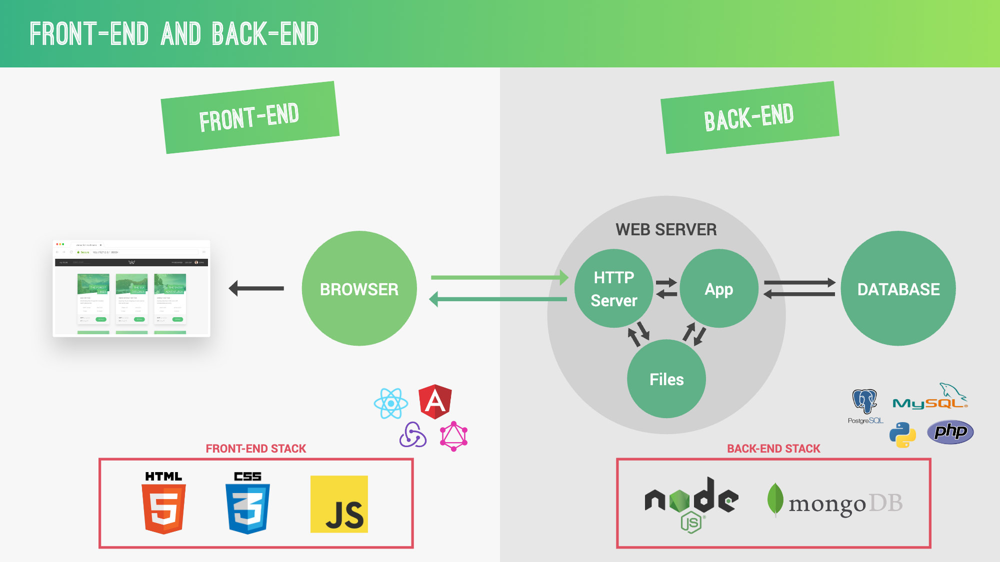
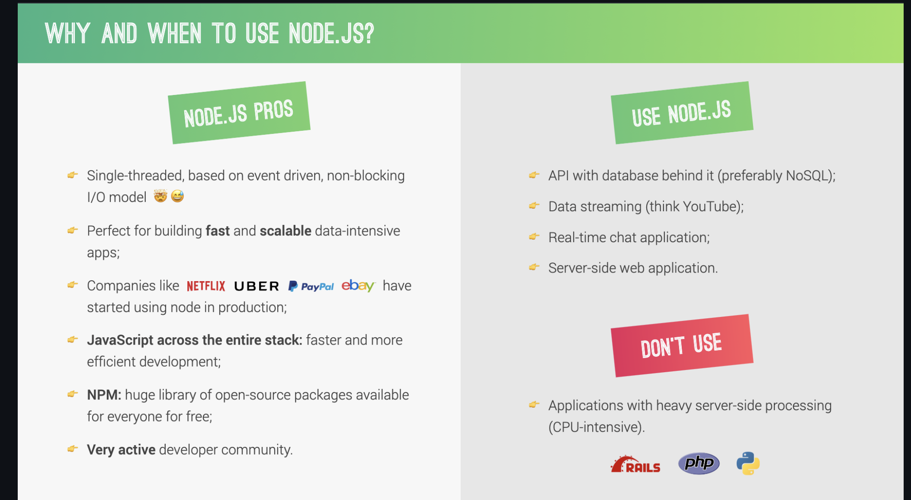

# Introduction to Node.js

## Slide 1: What is Node.js?


Node.js is a powerful JavaScript runtime built on Chrome's V8 JavaScript engine. It allows you to run JavaScript on the server-side, enabling the development of fast and scalable network applications.

Key points:

- Open-source, cross-platform runtime environment
- Uses an event-driven, non-blocking I/O model
- Ideal for building scalable network applications



## Slide 2: History and Background

Node.js was created by Ryan Dahl in 2009, addressing the limitations of traditional web-serving techniques.

Timeline:

- 2009: Initial release of Node.js
- 2011: npm (Node Package Manager) introduced
- 2015: Node.js Foundation established
- 2018: Node.js and JS foundations merged to form OpenJS Foundation

## Slide 3: Installing Node.js and npm

To get started with Node.js, you need to install it on your system:

1. Visit the official Node.js website: https://nodejs.org
2. Download the LTS (Long Term Support) version for your operating system
3. Follow the installation wizard
4. Verify installation by opening a terminal and running:

```bash
node --version
npm --version
```

Run the first file

```bash
node index.js

```


[More Details in NodeJs documentation](https://nodejs.org/en/learn/getting-started/introduction-to-nodejs)
