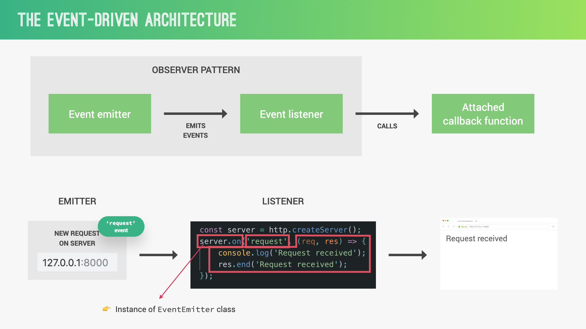
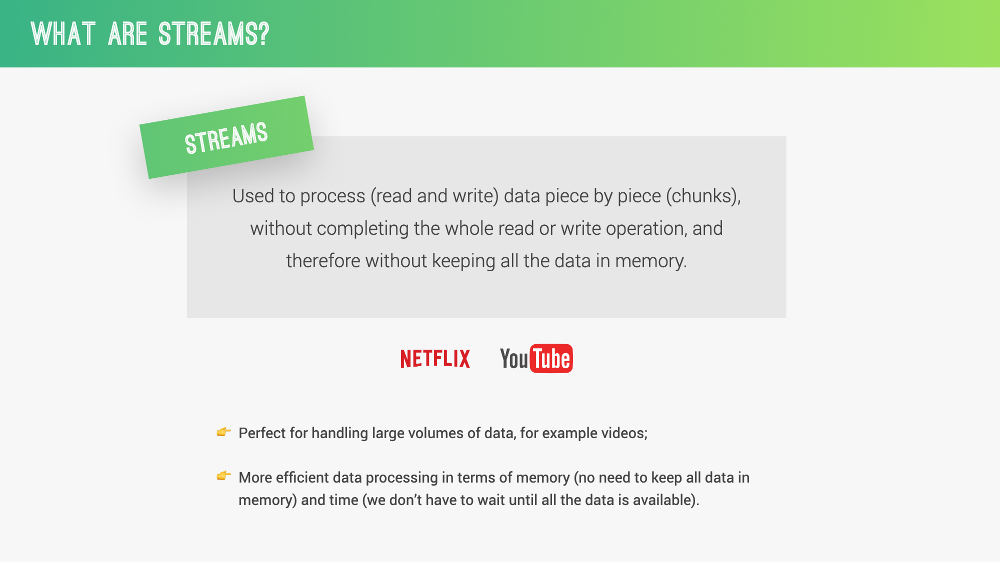
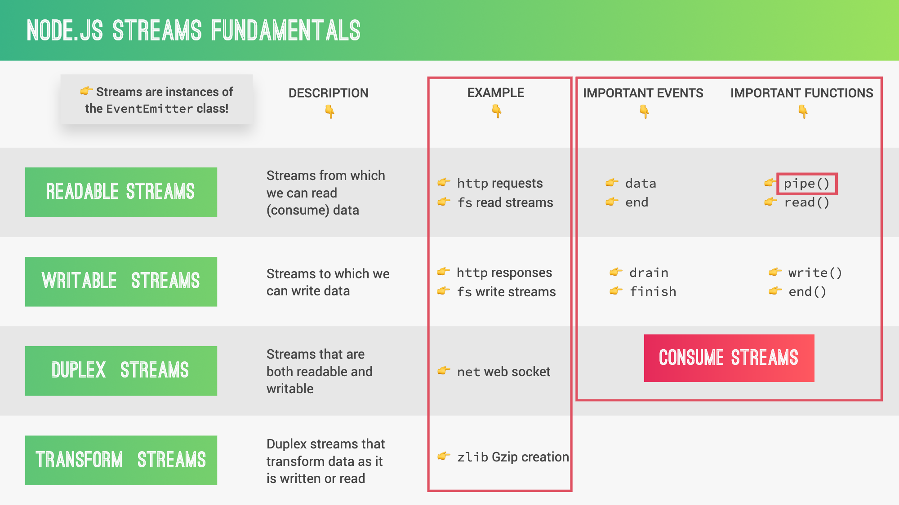

# Core Modules in Node.js

## 3.1. File System (fs)

The `fs` module provides an API for interacting with the file system.

### Key Functions:

- `fs.readFile()` / `fs.readFileSync()`
- `fs.writeFile()` / `fs.writeFileSync()`
- `fs.appendFile()` / `fs.appendFileSync()`
- `fs.unlink()` / `fs.unlinkSync()`
- `fs.mkdir()` / `fs.mkdirSync()`

### Example: Reading and Writing Files

```javascript
const fs = require("fs");

// Asynchronous read
fs.readFile("input.txt", "utf8", (err, data) => {
  if (err) {
    console.error("Error reading file:", err);
    return;
  }
  console.log("File contents:", data);

  // Asynchronous write
  fs.writeFile("output.txt", data.toUpperCase(), (err) => {
    if (err) {
      console.error("Error writing file:", err);
      return;
    }
    console.log("File written successfully");
  });
});
```

### Challenge:

Create a function that reads a directory and lists all files and subdirectories within it.

## 3.2. Path

The `path` module provides utilities for working with file and directory paths.

### Key Methods:

- `path.join()`
- `path.resolve()`
- `path.dirname()`
- `path.basename()`
- `path.extname()`

### Example: Working with Paths

```javascript
const path = require("path");

const filePath = "/home/user/documents/file.txt";

console.log("Directory name:", path.dirname(filePath));
console.log("Base name:", path.basename(filePath));
console.log("Extension:", path.extname(filePath));

const newPath = path.join("/home/user", "documents", "newfile.txt");
console.log("New path:", newPath);
```

### Challenge:

Create a function that takes a file path as input and returns an object containing the directory name, base name, and file extension.

## 3.3. HTTP and HTTPS

The `http` and `https` modules allow Node.js to transfer data over HTTP/HTTPS protocols.

### Key Concepts:

- Creating an HTTP server
- Making HTTP requests
- Handling routes

### Example: Creating a Simple HTTP Server

```javascript
const http = require("http");

const server = http.createServer((req, res) => {
  res.writeHead(200, { "Content-Type": "text/plain" });
  res.end("Hello World\n");
});

server.listen(3000, () => {
  console.log("Server running at http://localhost:3000/");
});
```

Difference Between HTTP and HTTPS


## 3.4. URL

The `url` module provides utilities for URL resolution and parsing.

### Key Methods:

- `url.parse()`
- `url.format()`
- `new URL()`

### Example: Parsing a URL

```javascript
const url = require("url");

const myUrl = new URL("https://example.com:8080/path?query=value#hash");

console.log("Protocol:", myUrl.protocol);
console.log("Host:", myUrl.host);
console.log("Pathname:", myUrl.pathname);
console.log("Search:", myUrl.search);
console.log("Hash:", myUrl.hash);
```

## 3.5. Events

The `events` module provides a way to work with events in Node.js.
Event-driven programming is a paradigm where the flow of the program is determined by events. This approach is particularly useful for applications that need to respond to user input, hardware signals, or messages from other programs.

### Key Concepts:

- EventEmitter class
- Emitting events
- Listening for events



1. **EventEmitter Class**:

   - The core of Node.js' event system.
   - Many built-in modules inherit from EventEmitter.

2. **Event Listeners**:

   - Functions that are called when an event is emitted.
   - Multiple listeners can be attached to a single event.

3. **Event Loop**:

   - Allows Node.js to perform non-blocking I/O operations.
   - Offloads operations to the system kernel when possible.

4. **Error Events**:
   - Special type of event in Node.js.
   - If not handled, can crash the Node.js process.

### Example: Creating and Using an Event Emitter

```javascript
const EventEmitter = require("events");

class MyEmitter extends EventEmitter {}

const myEmitter = new MyEmitter();

myEmitter.on("event", () => {
  console.log("An event occurred!");
});

myEmitter.emit("event");
```

### Challenge:

Create a custom `Logger` class that extends `EventEmitter`. It should have methods like `log()`, `error()`, and `warn()` that emit corresponding events.

## 3.6. Stream

Streams are objects that let you read data from a source or write data to a destination in continuous fashion.
Streams are one of the fundamental concepts in Node.js, used to handle reading/writing files, network communications, or any kind of end-to-end information exchange.



1. **Types of Streams**:

   - Readable: for reading data (e.g., fs.createReadStream())
   - Writable: for writing data (e.g., fs.createWriteStream())
   - Duplex: both Readable and Writable (e.g., net.Socket)
   - Transform: Duplex streams that can modify or transform data (e.g., zlib.createGzip())

2. **Buffering**:

   - Streams use an internal buffer to store data.
   - highWaterMark option sets the buffer size limit.

3. **Piping**:

   - Streams can be connected using pipe() method.
   - Allows for efficient data transfer between streams.

4. **Backpressure**:
   - Mechanism to prevent fast Readable streams from overwhelming slow Writable streams.



### Example: Reading from a Stream

```javascript
const fs = require("fs");

const readStream = fs.createReadStream("input.txt");

readStream.on("data", (chunk) => {
  console.log("Received chunk of data:");
  console.log(chunk);
});

readStream.on("end", () => {
  console.log("Finished reading data");
});
```

## 3.7. Command Line in Node.js

Working with the command line is a crucial skill for Node.js developers. Node.js provides built-in functionality to create command-line interfaces (CLIs) and process command-line arguments.

## Key Concepts:

1. **process.argv**: An array containing command-line arguments
2. **readline module**: For creating interactive command-line interfaces
3. **Command-line argument parsing**: Using libraries like `yargs` or `commander`
4. **Creating executable Node.js scripts**

`process.argv` is an array that contains the command-line arguments passed when the Node.js process was launched.

### Example: Basic usage of process.argv

```javascript
console.log(process.argv);

// If you run this script with: node script.js arg1 arg2
// The output will be:
// [
//   '/path/to/node',
//   '/path/to/script.js',
//   'arg1',
//   'arg2'
// ]
```

```bash
# for  more complex CLIs,
npm install yargs

```

### Challenge:

Create a script that reads a large file using streams and writes its content to a new file in all uppercase letters, also using streams.

## Final Challenge: File Processing Pipeline

Create a Node.js application that does the following:

1. Watches a directory for new text files
2. When a new file is added, read its contents using a read stream
3. Transform the contents to uppercase using a transform stream
4. Write the uppercase contents to a new file in a different directory using a write stream
5. Log events for each step of the process
