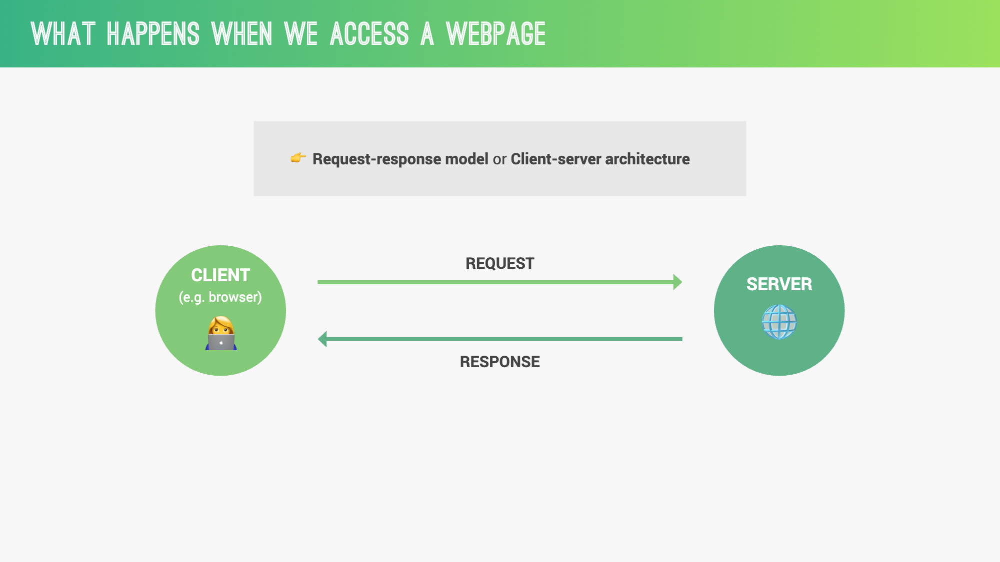
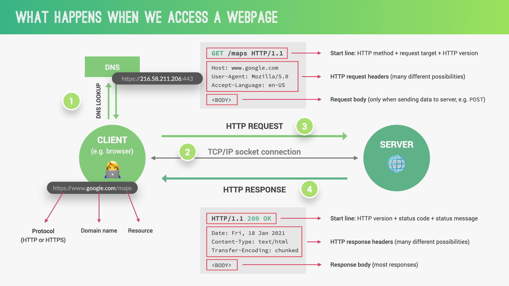
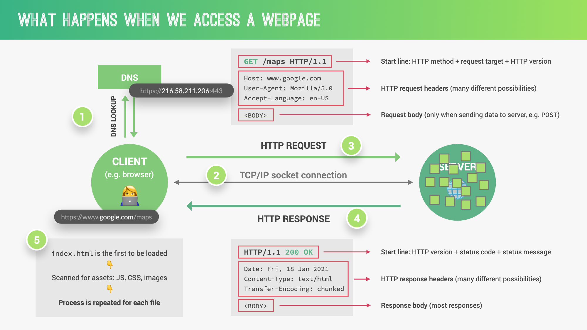
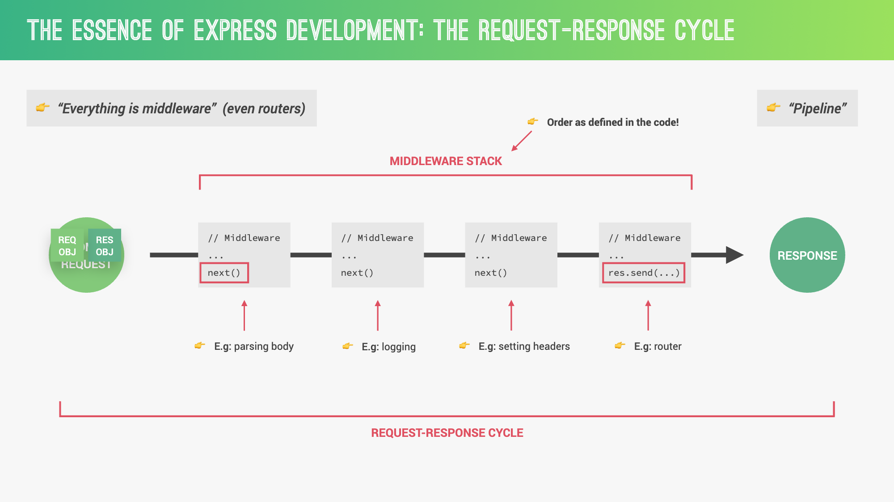

## 5.1 Introduction to HTTP Servers

Node.js provides the `http` module, which allows you to create an HTTP server. This module can listen to server ports and gives a response back to the client.

### Creating a Basic HTTP Server

```javascript
const http = require("http");

const server = http.createServer((req, res) => {
  res.statusCode = 200;
  res.setHeader("Content-Type", "text/plain");
  res.end("Hello, World!\n");
});

server.listen(3000, "127.0.0.1", () => {
  console.log("Server running at http://127.0.0.1:3000/");
});
```


### Challenge

1. **Create a Basic HTTP Server**: Set up a simple HTTP server that responds with "Hello, World!".

---

## 5.2 Serving Static Files

To serve static files such as HTML, CSS, and JavaScript, you can use the `fs` module to read files from the filesystem and send them as the response.

### Challenge

2. **Serve Static Files**: Serve an HTML file from the server. Ensure it displays correctly in the browser.

---

## 5.3 Handling Requests and Responses

Handling requests and responses is a crucial part of building web servers. You can parse URL parameters, handle different HTTP methods, and send various types of responses.







### Challenge

3. **Handle URL Parameters**: Create an endpoint that takes URL parameters and responds with a JSON object containing those parameters.

---

## 5.4 Routing

Routing refers to how an application’s endpoints (URIs) respond to client requests. You can create routes for different paths and HTTP methods.

### Basic Routing

```javascript
const http = require("http");

const server = http.createServer((req, res) => {
  if (req.method === "GET" && req.url === "/") {
    res.statusCode = 200;
    res.setHeader("Content-Type", "text/plain");
    res.end("Welcome to the Homepage!");
  } else if (req.method === "GET" && req.url === "/about") {
    res.statusCode = 200;
    res.setHeader("Content-Type", "text/plain");
    res.end("About Us");
  } else {
    res.statusCode = 404;
    res.end("Not Found");
  }
});

server.listen(3000, "127.0.0.1", () => {
  console.log("Server running at http://127.0.0.1:3000/");
});
```

### Challenge

4. **Implement Routing**: Set up routes for `/`, `/about`, and a 404 page for other paths.

---

## 5.5 Middleware

Middleware functions are functions that have access to the request object (`req`), the response object (`res`), and the next middleware function in the application’s request-response cycle. They can execute any code, make changes to the request and response objects, end the request-response cycle, and call the next middleware function in the stack.


### Challenge

5. **Add Middleware**: Implement a logging middleware that logs each request to the console, showing the method and URL.
