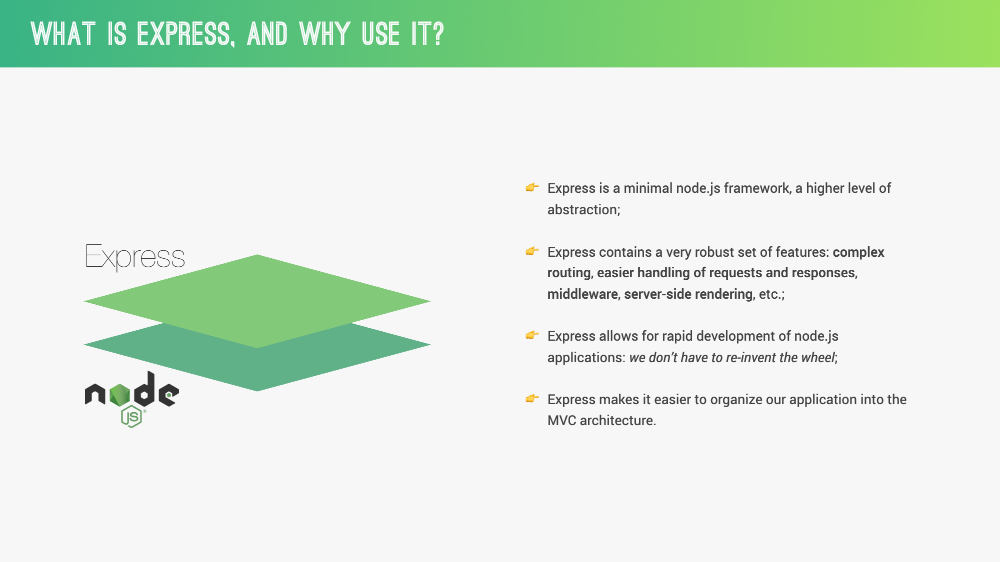
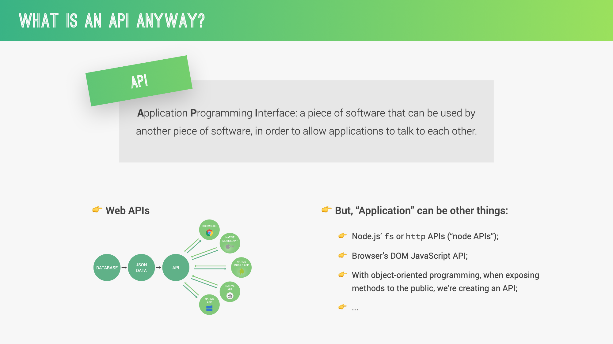
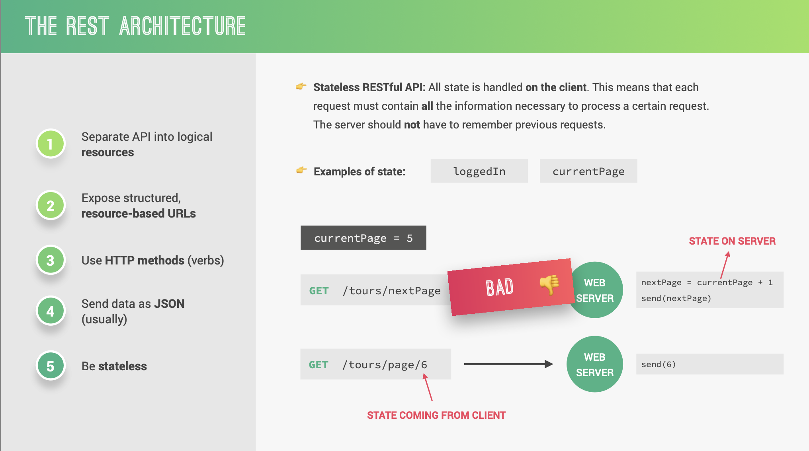
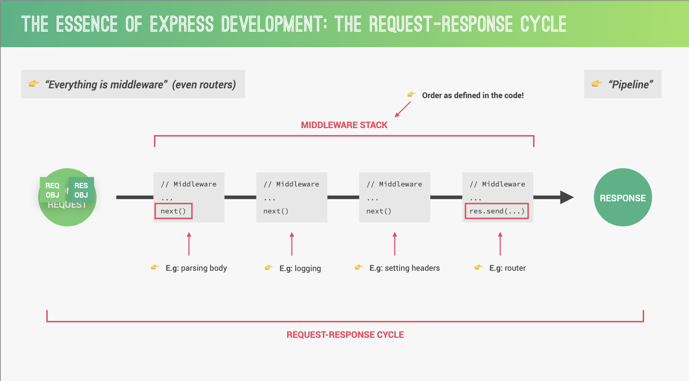

Framework

## 6.1. Introduction to Express.js

Express.js is a minimal and flexible Node.js web application framework that provides a robust set of features for web and mobile applications. It's the de facto standard server framework for Node.js.

Key features:

- Robust routing
- Focus on high performance
- Super-high test coverage
- HTTP helpers (redirection, caching, etc.)
- View system supporting 14+ template engines
- Content negotiation
- Executable for generating applications quickly





## 6.2. Setting Up an Express Server

To set up an Express server, you first need to install Express:

```bash
npm init -y
npm install express
```

Then, create a basic server:

Save this as `server.js` and run it with `node server.js`.

## 6.3. Routing with Express

Express provides a powerful routing mechanism. You can define routes for different HTTP methods and URLs.

## 6.4 REST Architecture

**REST (Representational State Transfer)** is an architectural style for designing networked applications. It relies on a stateless, client-server, cacheable communications protocol, most commonly the HTTP protocol.

### Key Concepts of REST

1. **Resources and URIs**

   - **Resource:** Any information that can be named, such as a document, image, or a service. In REST, resources are identified by URIs (Uniform Resource Identifiers).
   - **URI:** A uniform resource identifier is a string that provides a way to access a resource.

2. **Stateless Communication**

   - Each request from a client to a server must contain all the information needed to understand and process the request. The server does not store any context about the client between requests.

3. **Client-Server Architecture**
   - REST applications have a client-server architecture. The client handles the user interface and user experience, while the server manages data storage and business logic.

### HTTP Methods in REST

RESTful systems typically use HTTP methods to perform CRUD (Create, Read, Update, Delete) operations:

- **GET:** Retrieve a resource.
- **POST:** Create a new resource.
- **PUT:** Update an existing resource.
- **DELETE:** Remove a resource.
- **PATCH:** Partially update a resource.




## 6.5. Middleware in Express

Middleware functions have access to the request object (req), the response object (res), and the next middleware function in the application's request-response cycle, commonly denoted by `next`.



## 6.6. Handling Form Data

To handle form data, you need to use the `express.urlencoded()` middleware:

HTML form example:

```html
<form action="/submit-form" method="POST">
  <input type="text" name="name" placeholder="Name" />
  <input type="email" name="email" placeholder="Email" />
  <button type="submit">Submit</button>
</form>
```

## 6.7. Error Handling

Express comes with a built-in error handler. You can also write your own error handling middleware:

```javascript
app.get("/error", (req, res) => {
  throw new Error("This is a custom error");
});

// Custom 404 page
app.use((req, res, next) => {
  res.status(404).send("Sorry, that route doesn't exist.");
});

// Error handling middleware
app.use((err, req, res, next) => {
  console.error(err.stack);
  res.status(500).send("Something broke!");
});
```

## Hands-on Exercise: Build a Simple Express App

Let's build a simple Express app that demonstrates all these concepts:

1. Set up the project:

```bash
mkdir express-exercise
cd express-exercise
npm init -y
npm install express
```

2. Create `app.js`:

```javascript
const express = require("express");
const app = express();
const port = 3000;

// Middleware
app.use(express.json());
app.use(express.urlencoded({ extended: true }));

// Custom middleware
const logger = (req, res, next) => {
  console.log(`${req.method} ${req.url}`);
  next();
};
app.use(logger);

// Routes
app.get("/", (req, res) => {
  res.send("Welcome to the Express Exercise!");
});

app.get("/about", (req, res) => {
  res.send("This is the about page.");
});

app.get("/users/:userId", (req, res) => {
  res.send(`User ID: ${req.params.userId}`);
});

app.post("/submit", (req, res) => {
  const { name, email } = req.body;
  res.send(`Form submitted with Name: ${name} and Email: ${email}`);
});

// Error route
app.get("/error", (req, res) => {
  throw new Error("This is a custom error");
});

// 404 handler
app.use((req, res, next) => {
  res.status(404).send("Sorry, that route doesn't exist.");
});

// Error handler
app.use((err, req, res, next) => {
  console.error(err.stack);
  res.status(500).send("Something broke!");
});

app.listen(port, () => {
  console.log(`Server running at http://localhost:${port}`);
});
```

3. Run the app:

```bash
node app.js
```

4. Test the routes:
   - Visit `http://localhost:3000`
   - Visit `http://localhost:3000/about`
   - Visit `http://localhost:3000/users/123`
   - Use a tool like Postman to send a POST request to `http://localhost:3000/submit` with a JSON body
   - Visit `http://localhost:3000/error`
   - Visit any non-existent route

This exercise covers all the topics we've discussed: setting up an Express server, routing, middleware, handling form data, and error handling.

## Challenge: Extend the Express App

1. Add a new route that accepts query parameters and returns them in the response.
2. Create a custom middleware that checks for an "API key" in the request headers.
3. Implement a route that serves a static HTML file.
4. Add a route that returns data in JSON format.
5. Implement basic form validation in the `/submit` route.
